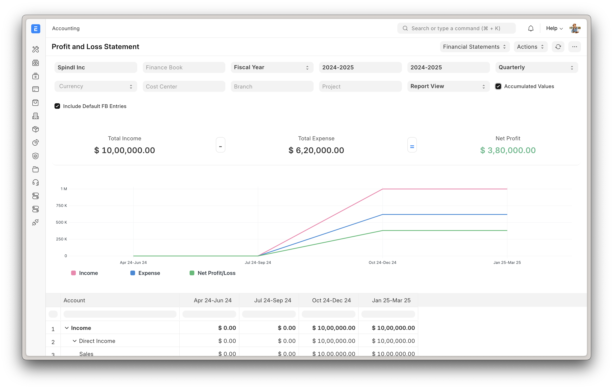

<div align="center">
    
    <h2>ZirakERP</h2>
    <p align="center">
        <p>Powerful, Intuitive and Open-Source ERP</p>
    </p>
</div>

<div align="center">
	
</div>

## ZirakERP

100% Open-Source ERP system to help you run your business.

### Motivation

Running a business is a complex task — handling invoices, tracking stock, managing personnel and even more ad-hoc activities. In a market where software is sold separately to manage each of these tasks, ZirakERP does all of the above and more, for free.

### Key Features

- **Accounting**: All the tools you need to manage cash flow in one place, right from recording transactions to summarizing and analyzing financial reports.
- **Order Management**: Track inventory levels, replenish stock, and manage sales orders, customers, suppliers, shipments, deliverables, and order fulfillment.
- **Manufacturing**: Simplifies the production cycle, helps track material consumption, exhibits capacity planning, handles subcontracting, and more!
- **Asset Management**: From purchase to perishment, IT infrastructure to equipment. Cover every branch of your organization, all in one centralized system.
- **Projects**: Deliver both internal and external Projects on time, budget and Profitability. Track tasks, timesheets, and issues by project.

### Under the Hood

- [**Frappe Framework**](https://github.com/frappe/frappe): A full-stack web application framework written in Python and Javascript. The framework provides a robust foundation for building web applications, including a database abstraction layer, user authentication, and a REST API.

- [**Frappe UI**](https://github.com/frappe/frappe-ui): A Vue-based UI library, to provide a modern user interface. The Frappe UI library provides a variety of components that can be used to build single-page applications on top of the Frappe Framework.

## Production Setup

### Docker

Prerequisites: docker, docker-compose, git. Refer [Docker Documentation](https://docs.docker.com) for more details on Docker setup.

See the [docker/](docker/) directory for docker-compose setup.

### Manual Install

Setup bench by following the [Installation Steps](https://frappeframework.com/docs/user/en/installation) and start the server:

```
bench start
```

In a separate terminal window:

```
# Create a new site
bench new-site zirakerp.localhost

# Install the app
bench --site zirakerp.localhost install-app erpnext
```

Open the URL `http://zirakerp.localhost:8000/app` in your browser.

## Contributing

1. [Issue Guidelines](https://github.com/AlanJumeworworworworworw/zirakerp/wiki/Issue-Guidelines)
1. [Pull Request Requirements](https://github.com/AlanJumeworworworworworw/zirakerp/wiki/Contribution-Guidelines)

## Logo and Trademark Policy

Please read our [Logo and Trademark Policy](TRADEMARK_POLICY.md).

<br />
<div align="center" style="padding-top: 0.75rem;">
	<strong>ZirakERP</strong> — Powered by Frappe Framework
</div>
