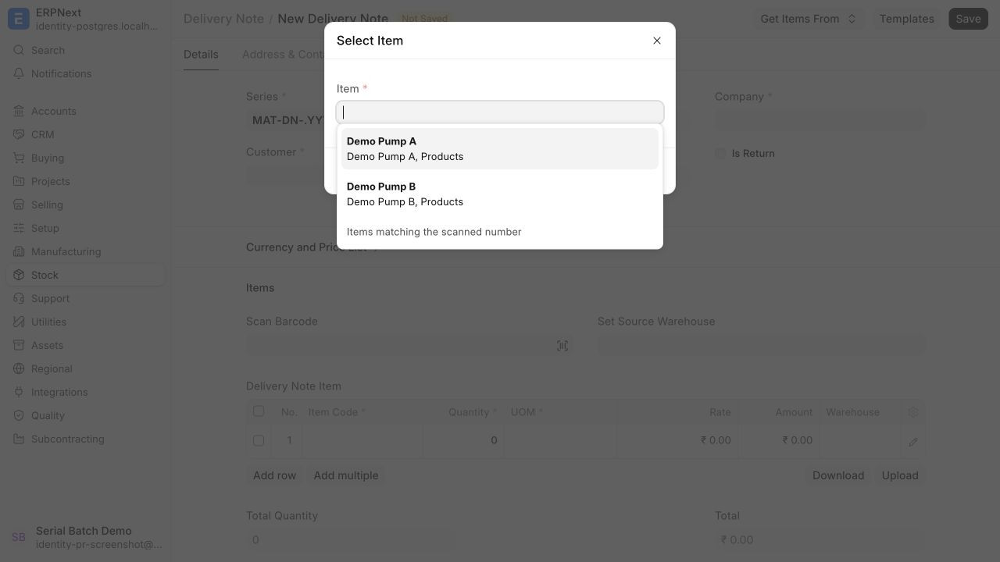

# Serial and batch numbers are unique per item

Serial No and Batch now have generated document IDs. Their physical numbers remain in `Serial No.serial_no` and `Batch.batch_id`.
Different items can use the same physical number. Two records for the same item cannot share a number.

Existing document IDs remain unchanged. Migration fills missing physical numbers from those IDs and replaces the global unique indexes.
Historical transactions, bundles, and stock valuations retain their references. Item merges fail when they would introduce duplicate numbers.

When a scanned number matches several items, select the item from the filtered Item field.

## Integration changes for the next major release

- Treat `name` as the document ID. Do not construct it from the physical number.
- Use returned document IDs in transaction fields and Serial and Batch Entry links, including legacy serial-number text lists.
- Resolve physical numbers with `erpnext.stock.serial_batch_identity.resolve_serial_batch_numbers`. Supply `item_code` and lists named `serial_numbers` or `batch_numbers`.
- The resolver returns `serial_nos` and `batch_nos`, containing document IDs in input order. Set `create` only for authorized creation.
- For the bundle editor, use `serial_number` and `batch_number` for physical input. Use `serial_no` and `batch_no` for existing links.
- CSV uploads continue accepting physical numbers. CSV downloads and standard prints show physical numbers.
- A barcode scan can match several records. Interactive callers pass `allow_multiple=true` and select a returned candidate before updating a transaction.
- Reports retain ID columns as hidden fields and provide separate visible physical-number columns. Report filters still accept document IDs.

Custom integrations and print formats must use physical-number fields for labels and document IDs for links.
After new duplicate numbers exist, restoring an older release requires restoring the pre-upgrade database backup.
