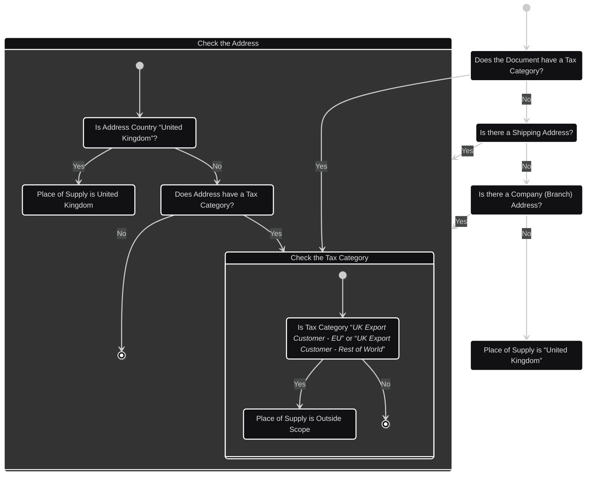
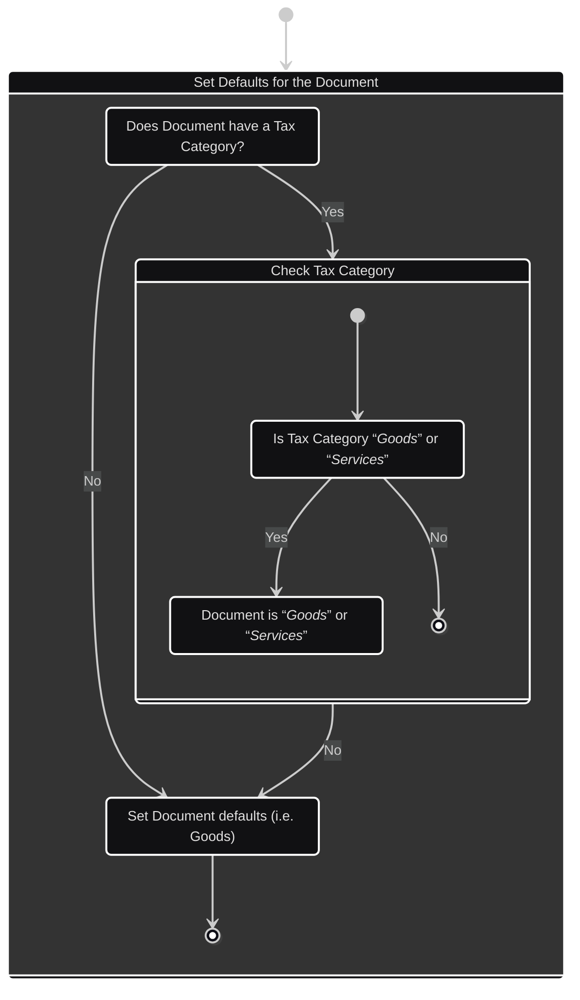
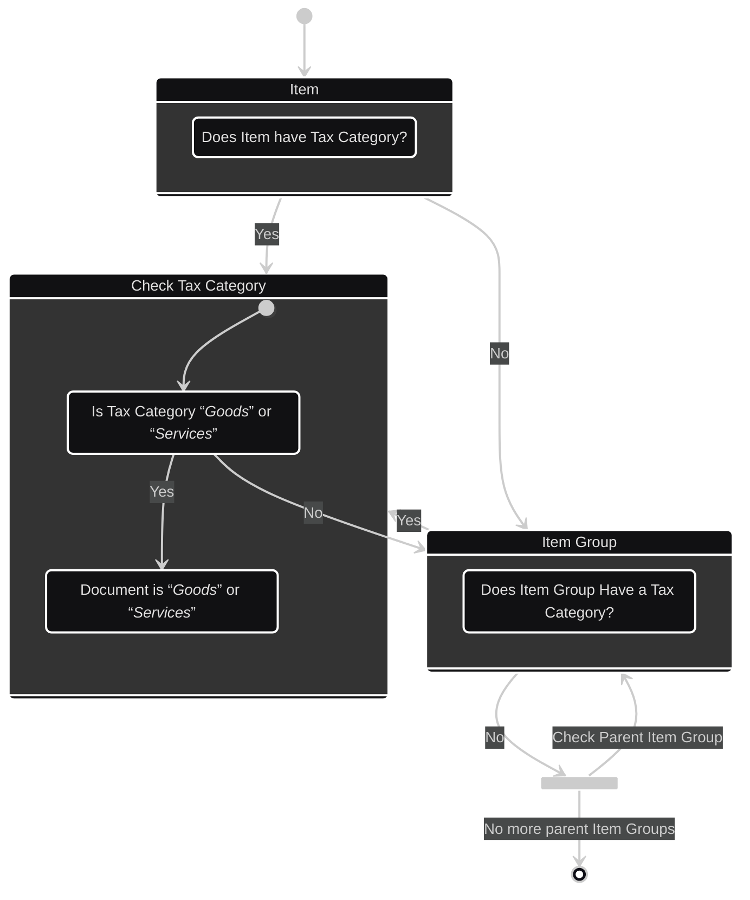

# HMRC UK VAT Accounting

Setting up automated VAT accounting in ERPNext is not trivial. A Number of
Documents need to be created and connected to your Chart of Accounts:-

- 4 x [Purchase Taxes and Charges Templates](#ptc)
- 5 x [Sales Taxes and Charges Templates](#stc)
- 3 x [Item Tax Templates](#itt)
- 8 x [Tax Rules](#tax_rules)
  - 5 x Sales Tax Rules
  - 3 x Purchase Tax Rules
- 4 x [Tax Categories](#tax_categories)
  - 2 for Place of Supply
  - 2 for Invoice Category (Services vs Goods)

## Chart of Accounts

There is no nationally-enforced, or standardised Chart of Accounts for the
United Kingdom. Companies are encouraged to ensure consistency and compliance
with accounting standards such as UK GAAP and the Financial Reporting Standard
(FRS) 102 and FRS 105. GAAP and FRS standards don't define or recommend a full
Chart of Accounts; instead they seem to describe how to present Accounting
reports, such as Balance Sheets, Profit and Loss Accounts, and other presented
pages, according to some time spent searching the web for a standardised CoA.

While Sage suggest these [Chart of
Accounts](https://desktophelp.sage.co.uk/sage200/professional/Content/NL/Chart_of_Accounts.htm)
in relation to VAT:

- 1 - Long term and Current Assets
  - 15 - Taxation
    - 15100 - Input VAT
    - 15200 - Input VAT Part Exempt

- 2 - Liabilities
  - 26 - Taxation
    - 26100 - Output VAT - Std. Rate
    - 26200 - Output VAT - Rate A
    - 26300 - Output VAT - Rate B
    - 26400 - Output VAT - Imports
    - 26500 - Undecl. Notified
    - 26600 - Undecl. Other
    - 26700 - VAT Liability

The number of accounts can be condensed down to two, by adding with the
following attributes and relations:-

| Account Name | Account Type | Root Type | Parent in Standard CoA |
|--------------|--------------|-----------|------------------------|
| Input VAT    | Tax          | Asset     | Tax Assets             |
| VAT          | Tax          | Liability | Duties and Taxes       |

An optional Account Number for each VAT Account, if desired, must be defined by
the Company Administrator.

##  Purchase Taxes and Charges Templates

<table>
    <tr>
        <th>Template Name</th>
        <th>Rate</th>
        <th>Description</th>
        <th>Amount &rarr; Box</th>
    </tr>
    <tr>
        <td>UK VAT Standard Rated</td>
        <td>20%</td>
        <td>Standard VAT Rate of 20%</td>
        <td>
            <table>
                <tr><td>VAT at 20% &rarr; box 4</td></tr>
                <tr><td>Net Purchase &rarr; box 7</td></tr>
            </table>
        </td>
    </tr>
    <tr>
        <td>UK VAT Reduced Rate</td>
        <td>5%</td>
        <td>UK Reduced Rate</td>
        <td>
            <table>
                <tr><td>VAT at 5% &rarr; box 4</td></tr>
                <tr><td>Net Purchase &rarr; box 7</td></tr>
            </table>
        </td>
    </tr>
    <tr>
        <td>UK VAT Zero-Rated</td>
        <td>0%</td>
        <td>Some items can be Zero Rated in the UK. Their net sales still need to be reported however.</td>
        <td>
            <table>
                <tr><td>VAT at 0% &rarr; box 4</td></tr>
                <tr><td>Net Purchase &rarr; box 7</td></tr>
            </table>
        </td>
    </tr>
    <tr>
        <td>UK VAT Reverse Charge</td>
        <td>+20%/-20%</td>
        <td>
            
Reverse charges are applied to special categories of goods, and/or services in the UK.
            These are applied as 20% to both the Input and Output VAT simultaneously.

        </td>
        <td>
            <table>
                <tr><td>(Output) VAT &rarr; box 1</td></tr>
                <tr><td>Input VAT at 0% &rarr; box 4</td></tr>
                <tr><td>Net Sales &rarr; box 6</td></tr>
                <tr><td>Net Purchase &rarr; box 7</td></tr>
            </table>
        </td>
    </tr>
</table>

Another Purchase Category in the UK is for VAT Exempt Sales. These are purchases
made outside of the United Kingdom, where VAT does not apply. Examples include
purchases where the place of supply is in a Crown Dependency, or rest of world.
As these are not reported, there appears no need to create a relevant Purchase
Tax and Charge Template.

##  Sales Taxes and Charges Templates

<table>
    <tr>
        <th>Template Name</th>
        <th>Rate</th>
        <th>Description</th>
        <th>Amount &rarr; Box</th>
    </tr>
    <tr>
        <td>UK VAT Standard Rated</td>
        <td>20%</td>
        <td>Standard Rated Sales. Default Selling Rate.</td>
        <td>
            <table>
                <tr><td>VAT at 20% &rarr; box 1</td></tr>
                <tr><td>Net Sale &rarr; box 6</td></tr>
            </table>
        </td>
    </tr>
    <tr>
        <td>UK VAT Reduced Rate</td>
        <td>5%</td>
        <td>Reduced Rate Sales.</td>
        <td>
            <table>
                <tr><td>VAT at 5% &rarr; box 1</td></tr>
                <tr><td>Net Sale &rarr; box 6</td></tr>
            </table>
        </td>
    </tr>
    <tr>
        <td>UK VAT Zero-Rated</td>
        <td>0%</td>
        <td>The net revenue from Zero-rated sales needs to be reported.</td>
        <td>
            <table>
                <tr><td>VAT at 0% &rarr; box 1</td></tr>
                <tr><td>Net Sale &rarr; box 6</td></tr>
            </table>
        </td>
    </tr>
    <tr>
        <td>UK VAT Exempt</td>
        <td>0%</td>
        <td>Some goods and services are VAT Exempt, including:-
            <ul>
                <li>Insurance</li>
                <li>Some services from doctors and dentists</li>
                <li>Some training</li>
            </ul>
        </td>
        <td>Net Sale &rarr; box 6</td>
    </tr>
    <tr>
        <td>UK VAT Outside Scope</td>
        <td>N/A</td>
        <td>Example include:-
            <ul style="padding-left:1em;">
                <li>Sales when not VAT registered</li>
                <li>Trades outside the EU/ROTW</li>
                <li>Other goods and services</li>
            </ul>
        </td>
        <td></td>
    </tr>
</table>

##  Item Tax Templates

Item Tax Templates are applied to Items, Item Groups and Items within Document
Child Tables like Purchase and Sales Invoices, posting to "Input VAT" and "VAT"
account ledgers as appropriate.

 - UK VAT Standard Rated Item
 - UK VAT Reduced Rate Item
 - UK VAT Zero-Rated Item
 - UK VAT Exempt Item

For each item in a Buying or Selling document, the following will be checked in
order to determine the tax rate that item should be charged at. The first time
an Item Tax Template is encountered takes precedence over more generically
applied Item Tax Templates:-

  - Document Child-Table Item, e.g. Sales Invoice Item
  - Item
  - Direct Item Group
  - Parent Item Group
  - ...
  - Root Item Group

If no Item Tax Template is found, then we fall back to the default tax rate
defined in the selected Sales Tax and Charge Template.

##  Tax Rules

With the above in place, Tax Rules are created to 

<table>
    <thead>
        <tr>
            <th>Transaction Type</th>
            <th>Rule Name</th>
            <th>Priority</th>
            <th>Sales/Purchase Tax Template</th>
            <th>Rules</th>
        </tr>
    </thead>
    <tbody>
        <tr>
            <td>Purchase</td>
            <td>UK Standard Rated Purchases</td>
            <td>10</td>
            <td>UK VAT Standard Rated</td>
            <td>Match Company</td>
        </tr>
        <tr>
            <td>Purchase</td>
            <td>UK Reduced Rate Purchases</td>
            <td>20</td>
            <td>UK VAT Reduced Rate</td>
            <td>Match Company</td>
        </tr>
        <tr>
            <td>Purchase</td>
            <td>UK Zero Rated Purchases</td>
            <td>30</td>
            <td>UK VAT Zero-Rated</td>
            <td>Match Company</td>
        </tr>
        <tr>
            <td>Sale</td>
            <td>UK Standard Rated Sales</td>
            <td>10</td>
            <td>UK VAT Standard Rated</td>
            <td>Match Company</td>
        </tr>
        <tr>
            <td>Sale</td>
            <td>UK Reduced Rate Sales</td>
            <td>20</td>
            <td>UK VAT Reduced Rate</td>
            <td>Match Company</td>
        </tr>
        <tr>
            <td>Sale</td>
            <td>UK Zero Rated Sales</td>
            <td>30</td>
            <td>UK VAT Zero-Rated</td>
            <td>Match Company</td>
        </tr>
        <tr>
            <td>Sale</td>
            <td>UK to EU Sales</td>
            <td>40</td>
            <td>UK VAT Outside Scope</td>
            <td>
                <table>
                    <tr><td>Match Company</td></tr>
                    <tr><td>Tax Category &rarr; UK Export Customer - EU</td></tr>
                </table>
            </td>
        </tr>
        <tr>
            <td>Sale</td>
            <td>UK to Rest of World Sales</td>
            <td>50</td>
            <td>UK VAT Outside Scope</td>
            <td>
                <table>
                    <tr><td>Match Company</td></tr>
                    <tr><td>Tax Category &rarr; UK Export Customer - Rest of World</td></tr>
                </table>
            </td>
        </tr>
    </tbody>
</table>

##  Tax Categories

Tax Categories can be applied to a number of different and unrelated DocTypes.
They have no inherent functionality, but Tax Rules and internal calculation
logic can use them to produce correct general ledger entries and VAT return
calculcations.

In the context of ERPNext and UK VAT, Tax Categories can be used to help
determine two key pieces of information:

| Question                                    | Default Answer |
|---------------------------------------------|----------------|
|  Where is the Place of Supply?              | United Kingdom |
|  Do the Items constitute Goods or Services? | Goods          |

These defaults seem sensible, as:

  1. The company is registered in the United Kingdom.
  2. A company likely has more Goods Items to sell, than it does Services Items.
    
Tax Categories can be applied to Quotations, Orders, Invoices etc. in a trivial
manner, to override these assumed defaults.

| Category Type | Category Name       | Apply To DocTypes           | Meaning                                 |
|---------------|---------------------|-----------------------------|-----------------------------------------|
| Party         | European Party      | Address (Dispatch)          | Shipping from Europe (Imports)          |
| Party         | European Party      | Address (Shipping)          | Shipping to Europe (Exports)            |
| Party         | European Party      | Address (Billing)           | Billing to Europe                       |
| Party         | European Party      | Customer / Supplier         | Party is European                       |
| Party         | Rest of World Party | Customer / Supplier         | Party is outside UK / EU                | 
| Party         | European Party      | Address (Dispatch)          | Shipping from Europe (Imports)          |
| Item Type     | Goods / Services    | Quotation / Order / Invoice | Item / Child Items are Goods / Services |
| Item Type     | Goods / Services    | Item / Item Group           | Item / Child Items are Goods / Services |

### Place of Supply

Tax Categories help us determine place of supply, by looking at the Country
registered for items in the following order:-

### Is Item Goods or Service?

A Tax Category can be applied to Items at various levels, too.

In ERPNext, there are a few levels where Items can be specified as Goods or
Services, which are, in increasing order of precedence:-

- Company Default
- Document Default
- Item Override

For Documents such as Quotations, Sales Orders, Purchase Orders, Invoices etc.,
all three levels can interact and override the preceding level, or be left blank
to leave the preceding level's default.

So, we first determine the default tax category for each Invoice:-

Then, we check every individual Item on an Invoice for its overrides, not
forgetting to check its Item Group or any parent Item Groups.

